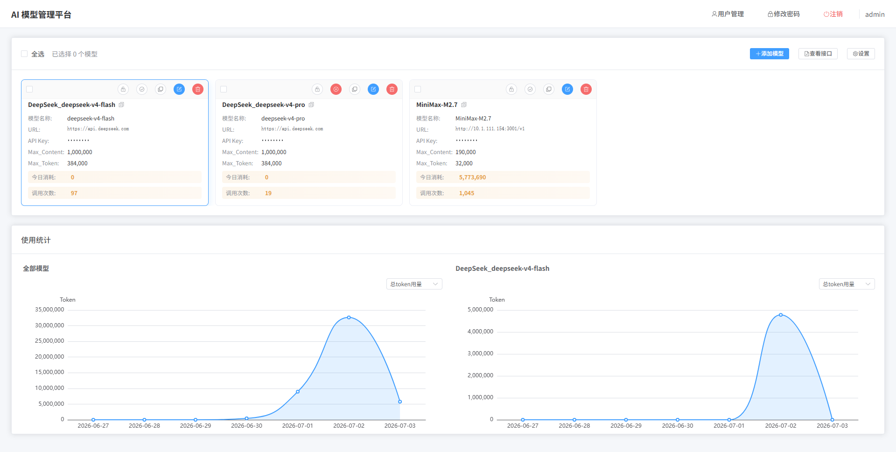

# LLM Manager

一个简洁的个人大模型管理工具，提供统一代理接口，支持模型自动切换、故障转移和用量统计。

## ✨ 特性

- 🤖 支持 OpenAI Chat Completions / Anthropic Messages / OpenAI Responses API 三种格式统一代理
- 🔄 故障自动转移：模型请求失败时自动切换到备用模型
- 🔒 模型锁定机制：失败模型自动锁定 10 分钟（时间可设置）
- 📊 实时 Token 用量追踪，按模型分组统计
- 🎨 支持多种 API 格式，自定义模型参数
- 🖱️ 拖拽排序模型优先级
- 🤝 **可在各种 Agent 工具中接入**，替代 `deepseek-copilot-bridge` 等工具，可直接在 **VSCode Copilot** 中接入使用

### 📌 模型调用策略

1. **优先调用**：优先使用指定的模型
2. **按序调用**：按拖拽排序的顺序依次尝试可用模型
3. **自动跳过**：调用时自动忽略锁定和禁用的模型
4. **故障转移**：遇到错误则锁定当前模型并切换到下一个模型

## 🚀 快速开始



### 环境要求

- Node.js >= 22.0.0
- npm >= 10.0.0

### 安装

```bash
npm install -g ai-models-manager
```

### 启动服务

```bash
# 启动服务（默认端口 11888）
ai-server start
```

### 访问地址

- **模型管理页面**: http://localhost:11888

### 默认账号

- **用户名**: `admin`
- **密码**: `admin`

> 首次登录后请及时修改密码！

## 📖 使用方法

### CLI 命令

```bash
ai-server start     # 启动服务
ai-server stop      # 停止服务
ai-server restart   # 重启服务
ai-server status    # 查看状态
ai-server logs      # 查看日志
```

### 添加模型

1. 点击顶部「添加」按钮
2. 选择供应商或选择「自定义」
3. 填写 Base URL 和 API Key
4. 在模型列表中添加模型配置
5. 点击「提交」保存

> 💡 **模型配置参数参考**: [https://models.dev/api.json](https://models.dev/api.json)

### 全局设置

1. 点击顶部「设置」按钮
2. 设置最大内容长度和最大 Token
3. 点击「确定」保存

> 值为 0 时，各模型使用自身配置；值大于 0 时，统一使用此处设置的数值

### 模型卡片操作

- **锁定按钮**（🔒）：手动锁定模型，锁定期间该模型不会被调用。再次点击可解除锁定
- **禁用按钮**（⛔）：禁用模型，被禁用的模型完全不会参与调用，也不会显示在模型列表中
- **拖拽排序**：在模型列表中拖拽卡片可调整调用顺序，排在上面的模型优先级更高

## 🌐 代理接口

在管理页面点击「查看接口」可查看完整的代理地址，每个接口地址按用户名隔离（如 `{origin}/{username}/...`）。

### OpenAI 兼容接口

| 接口 | 方法 | 说明 |
|------|------|------|
| `/v1/models` | GET | 获取可用模型列表 |
| `/v1/chat/completions` | POST | Chat Completions API（标准 OpenAI 格式） |
| `/v1/responses` | POST | Responses API（新版 OpenAI 格式） |
| `/v1/test` | GET | 模型连通性测试 |

### Anthropic 兼容接口

| 接口 | 方法 | 说明 |
|------|------|------|
| `/v1/messages` | POST | Messages API（Anthropic 标准格式） |
| `/v1/anthropic/messages` | POST | Messages API（Anthropic 标准路径别名） |
| `/v1/anthropic` | GET | Anthropic 代理信息，返回端点说明 |

> 💡 Anthropic 接口支持将 OpenAI 格式的模型自动转换为 Anthropic 格式，可直接作为 Claude API 代理使用。

### Ollama 兼容接口

| 接口 | 方法 | 说明 |
|------|------|------|
| `/api/tags` | GET | 获取模型列表 |
| `/api/show` | POST | 获取模型详情 |
| `/api/version` | GET | 版本信息 |

### Agent / IDE 接入

本工具可替代 `deepseek-copilot-bridge`，作为统一的 AI 模型代理网关，直接在以下场景中接入：

- **VSCode Copilot**：在 Copilot 设置中将 API Base URL 指向本服务地址（如 `http://localhost:11888/admin/v1`），即可将 Copilot 的模型请求统一代理到本工具管理的任意模型
- **Cursor / Windsurf** 等 AI IDE：同样通过配置 OpenAI 兼容端点地址即可使用
- **各类 Agent 框架**（LangChain、AutoGPT 等）：使用 OpenAI / Anthropic SDK 直接指向本服务即可

## 📄 License

ISC